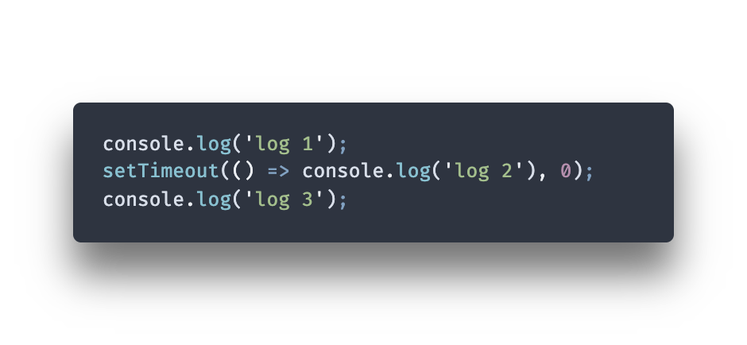

# Perguntas Conceituais

Alguns exemplos de perguntas teóricas e cenários hipotéticos que você pode utilizar ao longo da dinâmica, com exemplos de situações e palavras chaves que são interessantes de ouvir das candidatas.

---

**Cenário**: Ao desenvolver aplicações usando JS, é legal tomar um cuidado na hora de declarar algumas variáveis. Cada vez que criamos variável, podemos fazer isso de algumas formas (usando var/let/const).

**Pergunta**: Qual a diferença na utilização de var, let ou const? Quando se deve utilizar uma ou outra?

**Respostas**: É interessante ouvir da aluna algumas explicações sobre escopo (no caso de var) e de diferença de atribuição (no caso de let e const).

---

**Cenário**: Ao desenvolver aplicações usando JS, temos que lidar com código assíncrono e uma das formas ao utilizar setTimeout, que enfileira uma função para ser executada após a execução de todo código síncrono.

**Pergunta**: Imaginando que você tem o seguinte trecho de código:

O segundo log aparecerá após o primeiro e o terceiro. Por quê?

**Resposta**: A ideia é que aqui a aluna saiba comentar sobre código assíncrono, mesmo que sem entrar em detalhes, mas que tenha a ciência que a forma que os códigos síncronos/assíncronos são executados é diferente.

---

**Cenário**: Ainda sobre código assíncrono, é interessante saber explicar a diferença (mesmo que brevemente) sobre Callbacks e Promises

**Pergunta**: Como você lidou, nos projetos que desenvolveu, com chamadas assíncronas? Geralmente tratamos esses códigos com Callbacks e Promises, qual a diferença entre um e outro (seja tecnicamente ou até na forma como o código é lido)?

**Resposta**: É interessante ouvir que ambos os códigos são assíncronos, embora Promises sejam implementações mais novas para lidar com código assíncrono e realizam essa tarefa utilizando também uma leitura diferente (através de .then/.catch ou async/await).

---

**Cenário**: Em uma estrutura HTML, é comum trabalharmos com tags, ids e alguns atributos.

**Pergunta**: Em algumas estruturas HTML podemos encontrar atributos que começam com data-*, pra que servem esses "data-atributos"?

**Resposta**: A ideia aqui é ouvir uma resposta mais livre, já que esses atributos são, de fato, customizáveis para a necessidade do projeto e para que a pessoa que está desenvolvendo uma aplicação possa manipular dados conforme sua necessidade.

---

**Cenário**: Em uma estrutura HTML é extremamente importante prezar pela semântica e utilizar as tags da forma mais correta possível.

**Pergunta**: Quando estamos criando um HTML, podemos utilizar várias tags. Por que não é indicado usar somente div e deixar as outras tags de lado?

**Resposta**: A ideia é que aqui as alunas possam dar exemplos de outras tags e explicar os benefícios de realizar um HTML semântico.

---

**Cenário**: É extremamente necessário criar interfaces responsivas no dia de hoje, onde temos diversos dispositivos com telas diferentes que podem consumir conteúdos da internet.

**Pergunta**: Quando desenvolvemos um site, não costumamos desenvolver apenas para Desktop e sempre pensamos em diferentes tamanhos de tela. Como fazemos pra deixar nossa interface responsiva? Saberia dar algum exemplo?

**Resposta**: A ideia aqui é entender se a candidata sabe dos benefícios de criar uma interface responsiva e se sabe que para atingir esse objetivo é necessário utilizar media-queries em CSS.

---

**Cenário**: É comum lidarmos com posicionamento de elementos na nossa tela para seguir alguma especificação e criar uma interface.

**Pergunta**: Vamos imaginar uma `
` com display flex, como você faria para centralizar um elemento dentro dela? Por que você faria dessa forma?

**Resposta**: Nessa pergunta a aluna deveria comentar sobre flexbox e possivelmente responder algo sobre as regras align-items e justify-content, que são algumas das regras de ampla utilização hoje em dia.
